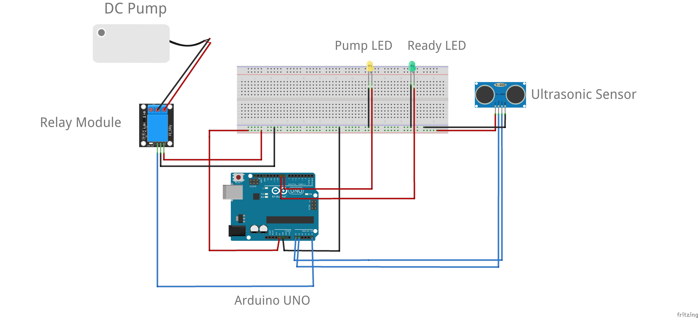

# Automatic-Sanitizer

Normal hand sanitizer dispensers work on mechanical triggers such as pressing them manually. This involves physical contact with the sanitizer dispenser which may also result in contamination. As a solution, some of the mechanisms such as triggering the dispenser using a pedal by the foot were proposed but not that effective and user-friendly. In order to overcome the above limitations, as an **effective, technologically feasible, and cost-effective solution, automated hand sanitizer dispensers** that work with sensors that can sense the proximity of a person’s hand and dispense the sanitizer are to be implemented. It should involve a mechanism that detects the person’s hand using a sensor, uses the sensed distance, and checks with a threshold distance. If the measured distance falls under the threshold, it should trigger the pump which dispenses the liquid. Also, necessary conditions should be added such that even if a person places his hand continuously for a long time within the threshold distance, the pumping action should take place only for a small time and not for the entire duration the distance is under the threshold distance. Hence, the objective is to build an automated hand sanitizer dispenser using `Arduino` with the conditions specified. 

## Circiut Diagram

